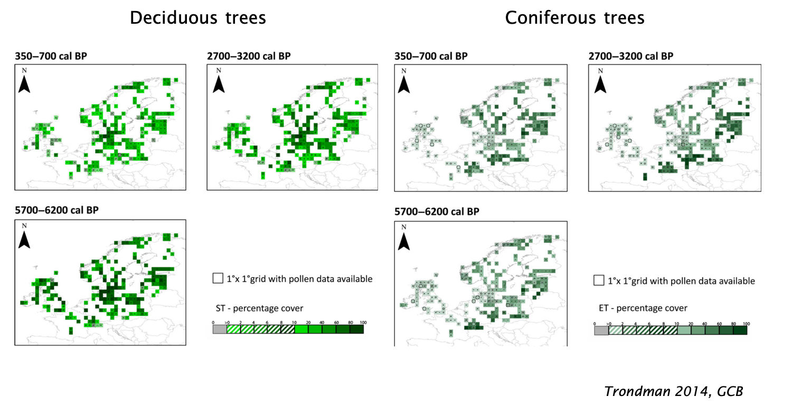
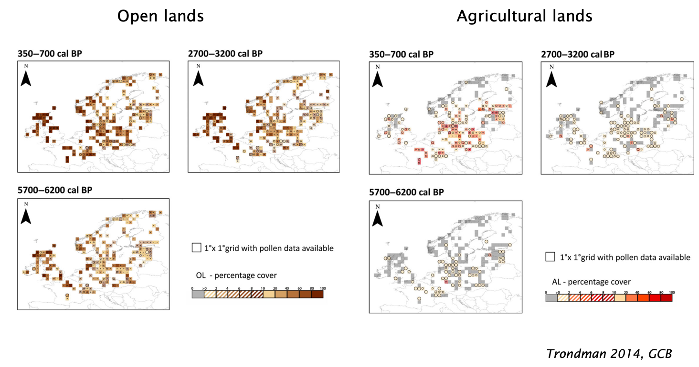

layout: true
.footer[
<!-- - @DrIsaBlg -->
- <i class="fab fa-github"></i>iboulangeat
<!-- - isabelle.boulangeat@irstea.fr -->
- décembre 2018, ENS Lyon
<!-- -  -->
]
---

class: title, fogscreen, shelf, no-footer, fit-h1
background-image: url(Holocene.JPG)

# States and transitions in the Holocene

---
class: fit-h1
# Extending the State and Transitions approaches

---
class: fit-h1
# Extending the State and Transitions approaches

---
class:
# Post glacial recolonisation context

---
class:
# Post glacial vegetation dynamics

---
class:
# Post glacial vegetation dynamics

---
class:
# Drivers of vegetation changes

.absolute.b-3.r-3[Gill 2014]

---
class:
# Vegetation dynamics

--

---
class:
# Hypotheses : Brainstorming

- Temperature
- Humans
- Herbivory
- Herbivory
- Fire
- Functional herbivore diversity
- Herbivore richness

- Interactions?

---
class: compact, col-2
# Hypotheses : exemples

- Cold temperature -> prevent forest expansion
- Cold temperature -> prevent deciduous tree regeneration
- Warmer temperatures -> prevent coniferous tree regeneration (compet. w/deciduous)
- Humans -> favour deciduous (because they make use of it)
- Humans -> prevent the forest closure (timber, settlements)
- Herbivory -> prevent deciduous regeneration (preferential feeding) 
- Herbivory -> maintain landscapes open (Vera hypothesis)
- Fire -> association to boreal forest (fuel)/ the growth of Betula forests can suppress fire
- Functional herbivore diversity -> reinforce herbivory effect
- Herbivore richness -> reinforce herbivory effect
- Herbivores richness -> association to forests if they use it a refugees from humans 

Interactions
- Humans: herbivores -> hunting neutralise herbivore effect
- Humans: herbivores ->  enhance herbivory effect by promoting their habitat
- Fire : humans -> more forest opening

---
class: no-footer
# Slides and Contact Information

Slides are at baseURL = "http://iboulangeat.github.io/Cours/"

Contact: isabelle.boulangeat@irstea.fr
