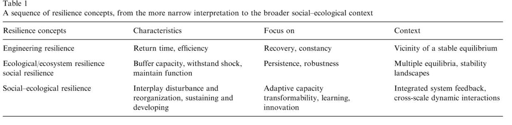
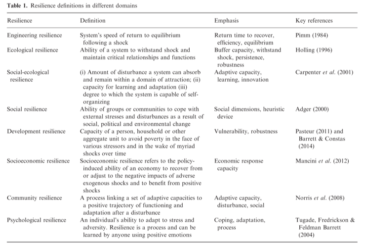

class: title, smokescreen, shelf, no-footer
background-image: url(ballandcup.gif)

# Resilience in a global change context
### From ecosystems to socio-ecological systems

---
layout: true
.footer[
<!-- - @DrIsaBlg -->
- <i class="fab fa-github"></i>iboulangeat
<!-- - isabelle.boulangeat@irstea.fr -->
- décembre 2018, ENS Lyon
<!-- -  -->
]
<!--  -->
---
class:
# Human impact is global

---
class:
# Human impact is not new

---
class:
# Evolution of the resilience concept

---
class:
# Resilience, a multidisciplinary concept

---
class:
# Resilience and system thinking
#### General system theory

Ludwig von Bertalanffy (1940's), Biologist

--

.fixed.r-3.ba-0.b-3[Russell Ackoff (1981), Economist]

---
class:
# Application of the general system theory

.absolute.w-30pct.h-30pct.pa-2.center.t-40pct.ba.bc-green.bw-3.br-3[System]
--
.absolute.w-20pct.h-30pct.pa-2.l-4.t-40pct[Environnement]
--
.absolute.w-30pct.h-30pct.pa-2.center.t-40pct.ba.bc-green.bw-3.br-3.bg-white[Ecological system]
.absolute.w-30pct.h-30pct.pa-2.l-3.t-60pct[Use, management]

.absolute.w-30pct.h-30pct.pa-2.l-70pct.t-60pct[Services]

---
class:
# Application of the general system theory
.absolute.w-30pct.h-30pct.pa-2.l-20-pct.t-40pct.ba.bc-green.bw-3.br-3.bg-white[Ecological system]

.absolute.w-30pct.h-30pct.pa-2.l-40pct.t-70pct[Services]

.absolute.w-30pct.h-30pct.pa-2.l-34pct.t-30pct[Use, management]
.absolute.w-30pct.h-30pct.pa-2.l-60pct.t-40pct.ba.bc-orange.bw-3.br-3.bg-white[Human system]
--
.absolute.w-90pct.h-50pct.pa-2.l-1.t-30pct.ba.bc-blue.bw-3.br-3[]

---
class:
# Scales in socioecosystems

.absolute.pa-2.r-1.b-2[Martin-Lopez, 2006]

---
class:
# Interactions accross scales

.absolute.pa-2.r-1.b-2[Folke, 2006]

---
class:
# Resilience of what ?
.absolute.w-30pct.h-30pct.pa-2.l-20-pct.t-40pct.ba.bc-green.bw-1.br-1.bg-white[Ecological system]

.absolute.w-30pct.h-30pct.pa-2.l-40pct.t-70pct[Services]

.absolute.w-30pct.h-30pct.pa-2.l-34pct.t-30pct[Use, management]
.absolute.w-30pct.h-30pct.pa-2.l-60pct.t-40pct.ba.bc-orange.bw-1.br-1.bg-white[Human system]
.absolute.w-90pct.h-50pct.pa-2.l-1.t-30pct.ba.bc-blue.bw-1.br-1[]
--
.absolute.w-30pct.h-30pct.pa-2.l-20-pct.t-40pct.ba.bc-green.bw-3.br-3[]
--
.absolute.w-30pct.h-30pct.pa-2.l-60pct.t-40pct.ba.bc-orange.bw-3.br-3[]
--
.absolute.w-90pct.h-50pct.pa-2.l-1.t-30pct.ba.bc-blue.bw-3.br-3[]

---
class: fit-h1
# Resilience of what ? Seeking a goal
#### Sustainable developement
--

UN-SDGs
> avoid significant adverse impacts [on ecosystems], including by strengthening their resilience

--

Aichi target
> no significant adverse impacts on threatened species and vulnerable ecosystems
> species and ecosystems are within safe ecological limits

---
class: fit-h1
# Resilience of what ? Seeking a goal
#### Multiple goals
Exemple:

- Agricultural goal: minimise variability of yield production and maximise resistance of biomass to pathogens and insect pests
- Conservation goal: maximise the compositional persistence and resilience (return to eq) of communities
---
class:
# Resilience to what ? Defining perturbations

<!--  -->
.absolute.w-40pct.h-50pct.pa-2.r-4.b-4.bw-1.br-1.ba.bg-white-80pct[
- pulse/press
- frequency
- spatially random or clustered
- directional change or not
- external or internal
- selective or not
]
<!--  -->

---
class: no-footer, img-right-full
# Effect of disturbance on resilience

- Correlation between several resilience measures in simulated ecological dynamic systems.

- Effect of the nature of the "to what?" on different measures of "of what?" in various ecological systems.

<!-- ---
class: no-footer, img-right-full
# Resilience and restauration
 -->

---
class:
# Resilience in practice

Role game...

---
class: no-footer
# Slides and Contact Information

Slides are at baseURL = "http://iboulangeat.github.io/Cours/"

Contact: isabelle.boulangeat@irstea.fr
