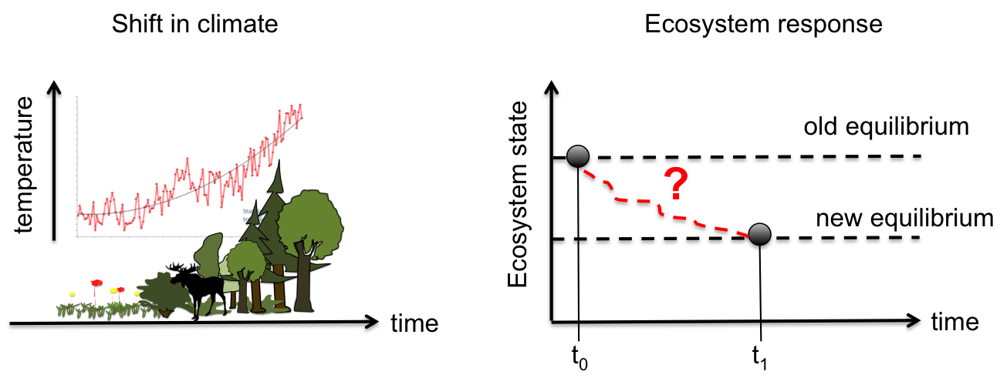

class: title, smokescreen, shelf, no-footer
background-image: url(polarbear.png)

# Resilience in a global change context
### From ecosystems to socio-ecological systems

---
layout: true
.footer[
<!-- - @DrIsaBlg -->
- <i class="fab fa-github"></i>iboulangeat
<!-- - isabelle.boulangeat@irstea.fr -->
- décembre 2018, ENS Lyon
<!-- -  -->
]
<!--  -->
---
class: title, smokescreen, shelf, no-footer
background-image: url(ballandcup.gif)

# Resilience and ecological dynamics
---
class:
# A stability perspective

--
.absolute.b-3.l-6[X]
.absolute.l-4.t-5[Y]
--

.absolute.t-5.r-4[attraction bassin]
.absolute.t-60pct.r-2[local equilibrium properties]

--

.absolute.b-3.l-6.bg-white.h-2.w-2[ ]
.absolute.l-4.t-5.bg-white.h-2.w-2[ ]
---
class: col-2
# Alternative stable states and catastrophic shifts

.absolute.r-3.b-4[Scheffer et al. 2001, Nature]

Main challenge : find alternative stable states

Systems:
- Woodland / Savanna
- Perennial herbs / bareground
- Lake (turbidity)
- Coral reefs

---
class:col-2
# Stochasticity and non-equilibrium dynamics

.absolute.r-3.b-3[Arnoldi et al. 2010, Journal Theoretical Biologie]

- size of the bassin of attraction
- temporal variability

- autoregression coefficient

---
class: col-2
# The quest for early warning signals
#### Critical slowing down

.absolute.r-3.b-3[Scheffer et al. 2003, Nature]
--
.absolute.l-4.b-4.w-30pct[but not necessarily followed by catastrophic shifts, see Kéfi et al. 2013, Oikos; Dai et al. 2015, PNAS]
---
class: no-footer, img-right-full
# Effect of disturbances on resilience

- Correlation between several resilience measures in simulated ecological dynamic systems.
- Multidimension!

.absolute.l-3.b-3[Radchuck et al. 2019, EcoLet]

---
class:
# Resilience in a multi-dimentional context
#### The use of hypervolumes

Barros et al. 2016, EcoLet

---
class: title, smokescreen, no-footer
background-image: url(Colonisation_arboles.jpg)

# Measuring resilience and transient dynamics
---

class: compact
# Beyond equilibrium: the transient phase

<!-- ---
class: fit-h1
# Shock versus continuous change

 -->

---
class: fit-h1
# Caracterizing the transient dynamics

---
class: fit-h1
# Application in the temperate-boreal ecotone

---
class: no-footer, img-right-full
# Application in the temperate-boreal ecotone

- A large climatic gradient
- A well documented region
- Climate change is expected to impact strongly these ecotone
- Economy strongly related to forestry and hunting

---
class: no-footer, fullbleed

.absolute.center.t-4.pa-2.ba.bw-0.h-20pct.w-40pct.bg-white-80pct[How the trophic interactions impact the transient dynamics of the vegetation?]

---
class: fit-h1, center
# The model : STM and Biomass population model

---
class: fit-h1
# Influence of climate on vegetation

---
class:
# Trajectories

---
class:
# Equilibrium shift

---
class:
# Impact of herbivores on stability

---
class: fit-h1
# Impact of herbivores on transient dynamics

---
class:
# Multidimentionality of stability

---
class: roomy
# Main results

- Herbivores induce a **shifts** at biome transitions
- Herbivores induce **more accumulated vegetation changes** in respnose to climate change
- Herbivores **slow down** the return to equilibrium
- Herbivory can have **opposite effects** depending on climate conditions
- Trophic interactions increases the **multidimentionality** of the resilience

---
class: title, smokescreen, shelf, no-footer
background-image: url(orcieres.png)

# From ecosystems to socio-ecological systems

---
class:
# Human impact is global

---
class:
# Human impact is not new

---
class:
# Evolution of the resilience concept

---
class:
# Resilience, a multidisciplinary concept

---
class:
# Resilience and system thinking
#### General system theory

Ludwig von Bertalanffy (1940's), Biologist

--

.fixed.r-3.ba-0.b-3[Russell Ackoff (1981), Economist]

---
class:
# Application of the general system theory

.absolute.w-30pct.h-30pct.pa-2.center.t-40pct.ba.bc-green.bw-3.br-3[System]
--
.absolute.w-20pct.h-30pct.pa-2.l-4.t-40pct[Environnement]
--
.absolute.w-30pct.h-30pct.pa-2.center.t-40pct.ba.bc-green.bw-3.br-3.bg-white[Ecological system]
.absolute.w-30pct.h-30pct.pa-2.l-3.t-60pct[Use, management]

.absolute.w-30pct.h-30pct.pa-2.l-70pct.t-60pct[Services]

---
class:
# Application of the general system theory
.absolute.w-30pct.h-30pct.pa-2.l-20-pct.t-40pct.ba.bc-green.bw-3.br-3.bg-white[Ecological system]

.absolute.w-30pct.h-30pct.pa-2.l-40pct.t-70pct[Services]

.absolute.w-30pct.h-30pct.pa-2.l-34pct.t-30pct[Use, management]
.absolute.w-30pct.h-30pct.pa-2.l-60pct.t-40pct.ba.bc-orange.bw-3.br-3.bg-white[Human system]
--
.absolute.w-90pct.h-50pct.pa-2.l-1.t-30pct.ba.bc-blue.bw-3.br-3[]

---
class:
# Scales in socioecosystems

.absolute.pa-2.r-1.b-2[Martin-Lopez, 2006]

---
class:
# Interactions accross scales

.absolute.pa-2.r-1.b-2[Folke, 2006]

---
class:
# Resilience of what ?
.absolute.w-30pct.h-30pct.pa-2.l-20-pct.t-40pct.ba.bc-green.bw-1.br-1.bg-white[Ecological system]

.absolute.w-30pct.h-30pct.pa-2.l-40pct.t-70pct[Services]

.absolute.w-30pct.h-30pct.pa-2.l-34pct.t-30pct[Use, management]
.absolute.w-30pct.h-30pct.pa-2.l-60pct.t-40pct.ba.bc-orange.bw-1.br-1.bg-white[Human system]
.absolute.w-90pct.h-50pct.pa-2.l-1.t-30pct.ba.bc-blue.bw-1.br-1[]
--
.absolute.w-30pct.h-30pct.pa-2.l-20-pct.t-40pct.ba.bc-green.bw-3.br-3[]
--
.absolute.w-30pct.h-30pct.pa-2.l-60pct.t-40pct.ba.bc-orange.bw-3.br-3[]
--
.absolute.w-90pct.h-50pct.pa-2.l-1.t-30pct.ba.bc-blue.bw-3.br-3[]

---
class: fit-h1
# Resilience of what ? Seeking a goal
#### Sustainable developement
--

UN-SDGs
> avoid significant adverse impacts [on ecosystems], including by strengthening their resilience

--

Aichi target
> no significant adverse impacts on threatened species and vulnerable ecosystems
> species and ecosystems are within safe ecological limits

---
class: fit-h1
# Resilience of what ? Seeking a goal
#### Multiple goals
Exemple:

- Agricultural goal: minimise variability of yield production and maximise resistance of biomass to pathogens and insect pests
- Conservation goal: maximise the compositional persistence and resilience (return to eq) of communities
---
class:
# Ecosystem services
> The benefits from Nature to People

---
class: no-footer
# Ecosystem services : exemples
.absolute.r-1.b-4.w-20pct[Commun international classification]

---
class:
# Bundles of services
#### A way to embrace multidimentionality
.absolute.r-1.b-2.w-20pct[De Groot 2010]

---
class:
# Resilience to what ? Defining perturbations
.absolute.l-4.b-3.w-30pct[Donohue 2015, EcoLet]

--
<!--  -->
.absolute.w-40pct.h-50pct.pa-2.r-4.b-4.bw-1.br-1.ba.bg-white-80pct[
- pulse/press
- frequency
- spatially random or clustered
- directional change or not
- external or internal
- selective or not
]
<!--  -->

---
class: no-footer
# Slides and Contact Information

Slides are at baseURL = "http://iboulangeat.github.io/Cours/"

Contact: isabelle.boulangeat@irstea.fr

---
class:
# Resilience in practice

Role game...
