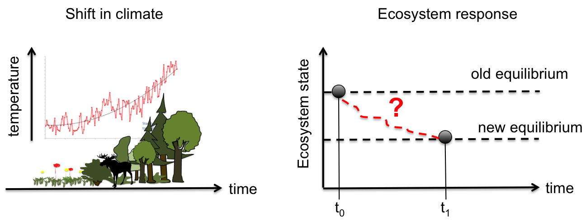

class: title, smokescreen, no-footer
background-image: url(Colonisation_arboles.jpg)

# Resilience and transient dynamics
---
layout: true
.footer[
- <i class="fab fa-github"></i>iboulangeat
<!-- - isabelle.boulangeat@irstea.fr -->
- décembre 2018, ENS Lyon
<!-- -  -->
]

---
class: compact
# Beyond equilibrium: the transient phase

<!-- ---
class: fit-h1
# Shock versus continuous change

 -->

---
class: fit-h1
# Caracterizing the transient dynamics

---
class: fit-h1
# Application in the temperate-boreal ecotone

---
class: no-footer, img-right-full
# Application in the temperate-boreal ecotone

- A large climatic gradient
- A well documented region
- Climate change is expected to impact strongly these ecotone
- Economy strongly related to forestry and hunting

---
class: title, fogscreen, no-footer
background-image: url(deer.jpg)
# How the trophic interactions impact the transient dynamics of the vegetation?

---
class: fit-h1, center
# The model : STM and Biomass population model

---
class: fit-h1
# Influence of climate on vegetation

---
class:
# Trajectories

---
class:
# Equilibrium shift

---
class:
# Impact on herbivores on stability

---
class: fit-h1
# Impact on herbivores on transient dynamics

---
class:
# Multidimentionality of stability

---
class: roomy
# Main results

- Herbivores induce a **shifts** at biome transitions
- Herbivores induce **more accumulated vegetation changes** in respnose to climate change
- Herbivores **slow down** the return to equilibrium
- Herbivory can have **opposite effects** depending on climate conditions
- Trophic interactions increases the **multidimentionality** of the resilience

---
class: no-footer
# Slides and Contact Information

Slides are at baseURL = "http://iboulangeat.github.io/Cours/"

Contact: isabelle.boulangeat@irstea.fr
