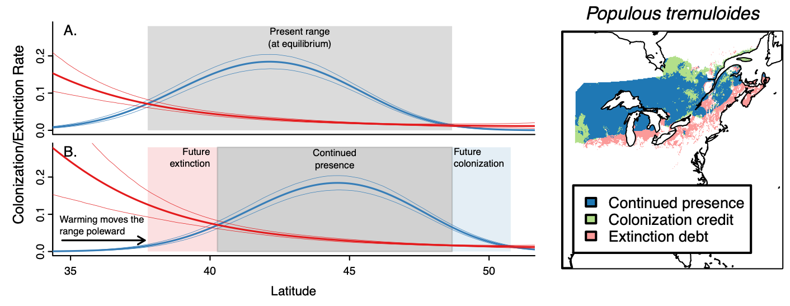
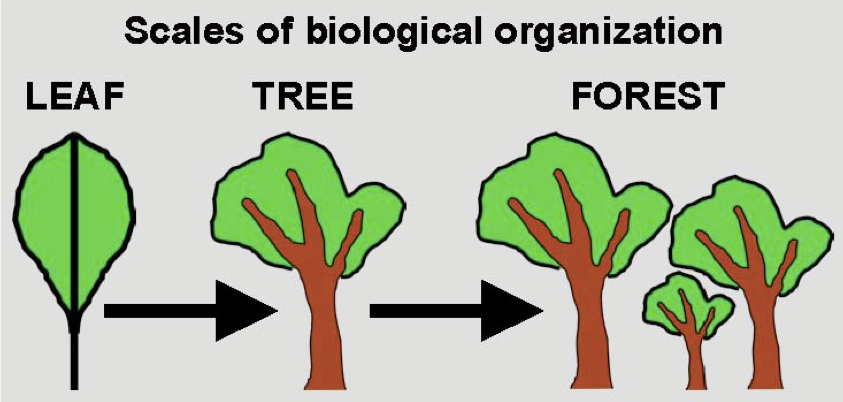
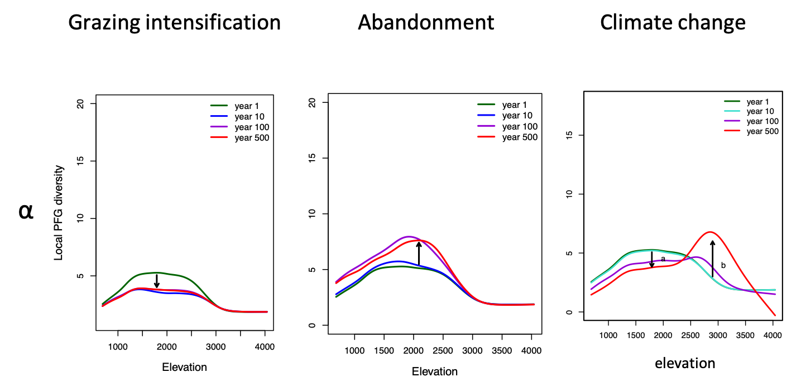
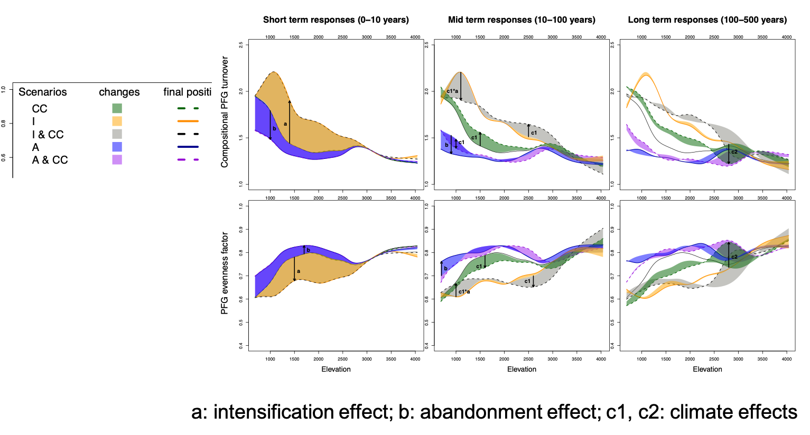

class: title, fogscreen, shelf, no-footer
background-image: url(aulnaie.jpg)

# Modelling vegetation distribution and dynamics

<!-- PARTIE 1, INTRO 30min-->

---
layout: true
.footer[
- <i class="fab fa-github"></i>iboulangeat
<!-- - isabelle.boulangeat@irstea.fr -->
- décembre 2018, ENS Lyon
<!-- -  -->
]
---
class: fit-h1
# The context: rapid global changes

--

--

--

.absolute.w-7-12th.pa-3.l-1-12th.t-20pct.bg-white-70pct[
]
<!-- .fixed.t-30pct.center.w-7-12th.pa-3.ba.bw-4.br-4.bg-white-80pct[
Questions:
- How to anticipate how ecosystems will respond to those changes?
- What would be the future spatial distribution of species?
] -->

---
class: col-2
# Coexistence theories

The ecological niche :
a set of environmental conditions

The metapopulation framework (neutral):
spatial and temporal dynamics

---
class: fit-h1
# Large scale predictions

--

- Niche-based model
- Habitat suitability models
- (correlative) species distributions models

---
class: fit-h1,center
# Niche-based species distribution models: principle

---
class: fit-h1, img-left
# Niche-based species distribution models: limits

--
.fixed.bg-white-80pct.t-50pct.l-10pct[colonisation credit]
.fixed.bg-white-80pct.t-80pct.l-10pct[extinction debt]

--

- No information about **transient dynamics**
  - demography
  - dispersal

--
- But many developement to integrate **species interactions**
  - cf. jSDM

---
class: fit-h1
# Models based on metapopulation dynamics

| STATES| **presence**| **absence**|
| ------| ---------| --------|
| **presence**| 1-p(e) | p(e) |
| **absence**| N.p(c)  | 1-N.p(c) |
 .absolute.fr.r-10pct.t-20pct.ofc.w-5-12th[e=extinction ; c=colonisation ; N=regional prevalence]
--

---
class: fit-h1, center
# Models based on metapopulation dynamics : exemple

_Talluto et al. 2017, Nature Ecology and Evolution_

---
class: title, fogscreen, shelf, no-footer
background-image: url(cover_world.jpg)

# Global vegetation to regional plant diversity

---
class: fit-h1, shelf, compact
# An history of DGVM

#### First climate-derived global map of potential vegetation
(Holdridge 1947)

---
class: fit-h1, shelf, compact
# An history of DGVM

#### First process-based model of global vegetation
(BIOME, Prentice 1992)

- **The aim** : simulate Net Primary Productivity
- **Main principle** : Photosynthesis ~ light + CO2 + temperature

---
class: fit-h1
Overview of a DGVM

---
class: fit-h1, img-right, compact
# An history of DGVM

#### Coupling with Global Circulation Models (GCM)
- **The aim** : improve climate models (GCM) incl. vegetation feedbacks
- **Main principle** : impact through Leaf Area Index (daily)

IBIS, Foley 1996 or TRIFFID, Cox 2000

---
class: fit-h1, img-right
# An history of DGVM

#### Integrating fire
- **The aim** : improve the modeling of biomass
- **Main principle** : coupling with a fire model

MC1, Bachelet 2001
---
class: fit-h1, compact, img-right
# An history of DGVM

#### Integrating human intervention
- **The aim** : simulating the impacts of land-use changes
- **Main principle** : adding modules of agricultural and forest management

IMAGE (Stehfest 2014) – economy, politics, social, technology

LPJmL - Lund-Potsdam-Jena managed Land

---
class:img-right, compact
# Stand models in forest ecology

#### Forest gap models
- **The aim** : optimize wood production for harvest
- **Main principle** : indiv. based models based on competition for light

JABOWA (Botkin 1972),
FORET (Shugart 1884),
ZELIG (Smith 1988),
LINKAGES (Post 1996),
SORTIE (Deutschmann 1997)

---
class:img-right, compact
# Stand models in forest ecology

#### Forest gap models

A evolution in the representation of space

---
class: fit-h1, compact, col-2
# From stands to landscape
#### Forest Landscape Models (FLM)
- **The aim** : account for landscape processes (fire, seed dispersal)
- **Main principle** : upscaling methods

LANDIS (He 1999), LANDCLIM (Schumacher 2004),
TreeMig (Lischke 2006), LANDIS II (Scheller 2007)

Upscaling methods:
- Group age into cohorts
- Group height into classes
- Group species into PFT
- Aggregate spatial scale
- Aggregate temporal scale
- Simulate representative cells

---
class: col-2, compact, fit-h1
# DGVM and forest models combinations
#### Integrating vegetation dynamics
- **The aim** : improve the simulation of transitions between biomes
- **Main principle** : model coupling (Hybrid-DGVM)

LPJ-GUESS (Smith 2003),
LM3-PPA (Weng 2015)

Include:
- height-structured competition for light
- within-PFT variation

---
class:fullbleed, no-footer, center

A scale perspective

---
class: roomy
# Common limitations
- **Data** intensive
- Difficult to learn/use/**parameterize**
- Often exlude **wetlands**
- Limited in representing **transitions** between biomes (forest/non-forest)
- Limited in representing **diversity** (focus on selected species)
- No **trophic interactions** (e.g. herbivores, pollinators…)

---
class: roomy
# Brainstorming

On a ces 3 objectifs
- Anticiper la réponse aux changements de climat et d'usages
- Représenter les transitions entre forêt et non-forêt ("treeline")
- Représenter la diversité des espèces (arbres, herbacées, ...)
- A l'échelle régionale (échelle des décisions de gestion)

**Quels mécanimes ou propriétés devraient être inclus?**

---
class: no-footer, center

---
class: compact
# Liens avec le climat
Gap models
- Via courbe de croissance (T°, précipitations, soil moisture, CO2)

Landscape models
- Via la dynamique des feux
- Via la démographie des espèces/groupes fonctionnels (e.g. TreeMig)
- Via un couplage avec un modèle d’habitat (e.g. FATE-HD)

DGVM
- Lien physiologique explicite
- Un couplage avec des modèles climatiques peut permettre une rétro-action (IBIS, TRIFFID)
---
class:
# Interactions biotiques
Gap models
- Compétition pour la lumière, les ressources du sol

Landscape models
- Compétition pour la lumière, les ressources du sol

DGVM
- Non en général
- Exemple de couplage avec des herbivores (Pachzelt et al. 2003)

---
class:
# Dispersion
Gap models
- Aucune (intra-peuplement)
- Couplage avec modèles de dispersion

Landscape models
- Kernel fonctions

DGVM
- Aucune

---
class: compact
# Démographie
Gap models
- Croissance et mortalité, courbes paramétrées par espèce
- Peuvent être fonction du climat, niveau de lumière (canopé).

Landscape models
- Paramètres démographiques plus ou moins précis

DGVM
- Flux de matière et d’énergie
- La régénération est pas vraiment décrite

---
class: compact
# Perturbations
Gap models
- Gestion forestière (différent types de coupes), sélection espèces

Landscape models
- Feux, coupes, plantations, pâturage (selon modèles)

DGVM
- Feux (mais limité), sécheresse, coupes, récolte, plantations, pâturage (selon modèles, mais grossier)
- Exemple d’intégration de facteurs technologique, économique, social, culturel et politiques (IMAGE)

---
class: compact
# La diversité représentée

Gap models
- Seulement des arbres

Landscape models
- Les groupes fonctionnels représentent en général les arbres principaux
- Les PFG de FATE-HD ont été construits pour représenter une diversité

DGVM
- Les types fonctionnels sont très grossiers
- Ajout de précision via un couplage avec un Gap Model (e.g. LPJ-GUESS)

---
class: fullbleed
background-color: black

.absolute.w-100pct.pa-2.center.t-40pct.ba.bw-0.br-0.bg-white-80pct[
# Modelling biodiversity
### The functional groups approach
]

---
class: compact, center, img-left
# Research essential elements

--

--
- Keep enough information to estimate the vegetation **diversity**
--

- Be able to model the **temporal response** of the vegetation to environmental changes
--

- Be able to represent vegetation **spatial distribution**

---
class:
# The emergent group approach

--

---
class:img-right, roomy
# Trait selection

How to choose the most important species traits ?

<!-- 
 -->

---
class:
# Trait selection
#### Application in the Ecrins National Parc

---
class:
# Is it enough to represent biodiversity?

--

---
class:
# Is it enough to represent biodiversity?
#### In the Ecrins National Parc

<!-- PARTIE 3 FATE-HD 30min pptx??-->

---
class: title, fogscreen, shelf, no-footer
background-image: url(cover_PhD.png)

# A biodiversity landscape model
## FATE-HD
---
class: compact, img-right
# FATE-HD among DVM

#### FAte of Terrestrial Ecosystems - Habitat Dispersal

A landscape model dealing with **forest and non-forests**

- Response to climate (via Habitat model)
- Vegetation diversity (PFG)
- Simpified population dynamics (competition for light, dispersal, demography)
- Semi-quantitatif (easy to parameterize)
- Disturbances (fire, grazing, mowing)

---
class:
# FATE-HD model

---
class: title, fogscreen, no-footer
background-image: url(Ecrins.png)
# Cas d'étude: le Parc National des Ecrins

---
class: img-right
# Le PNE, une majorité d'espaces ouverts

---
class: img-right
# Le PNE, des espaces pâturés

La moitié de la surface du parc est utilisée pour le pâturage extensif.
--

Flux de transhumance:

---
class:fullbleed, no-footer

---
class:fullbleedm no-footer

---
class:
# Parameterization : functional Groups

---
class:
# Parameterization : data

---
class:
# Validation

---
class:
# Validation

P1: Thermophilous pioneer trees (deciduous and pines)

---
class:
# Scenarios

---
class:
# Scenarios

--
.absolute.l-4.t-30pct[Intensification]

.absolute.r-5.t-30pct[Abandonment]

---
class:
# Baseline scenario

---
class:
# Climate change scenario

---
class:
# Climate change scenario

---
class:
# Colonisation barriers?

--

---
class:
# Climate change and land use scenarios

---
class:
# Interactions between drivers

---
class:
# Main conclusions about the treeline
--

1. **lag** effect in response to climate change
--

> dispersal and demography?

--
2. **interactions** between drivers

--
> A potential mass effect?

---
class: math
# Changes in (functional) diversity : measures
- Gamma diversity : regional PFG coexistence
- Beta diversity : landscape heterogeneity
- Alpha diversity : local diversity

--

#### True Diversity framework (Hill Numbers)

\\[
^qD = \left( \sum_{i=1}^S  (p_i^q) \right) ^{\frac{1}{1-q}}
\\]

\\(q=2\\) ;
\\(p=\\)relative abundance ;
\\(S=\\)total number of species ;

---
class:
# Changes in regional diversity

---
class:
# Changes in regional diversity

---
class:
# Changes in regional diversity

--

.absolute.l-3.t-5[addtitive effects]
--

.absolute.r-3.t-5[multiplicative effects]

---
class:
# Change in local diversity

---
class:
# Diversity decomposition
- change in **composition**
- change in **abundances**

--

\\[
^2D = ^0D \times EF
\\]

--
\\( ^0D = \\) richness -> beta = compositional turnover

\\( EF =\\) evenness factor -> beta = abundances re-arrangement

---
class: fit-h1, no-footer
# Changes over time, elevation and diversity dimensions

---
class: fit-h1
# Main conclusions about the diversity
--

- **Gamma diversity decreases** in all scenarios

- Heterogeneity (beta) in average decreases in case of tree colonization but increases in case of habitat loss

- The diversity response depends on **elevation**

- **Interactions** between drivers

---
class:
# Some limitations of the model FATE-HD
--

1. L’aspect semi-quantitatif: un nécessaire compromis
 (C’est la force et la faiblesse de ce modèle)

2. Pas de lien mécaniste avec le climat

3. Compétition pour les ressources du sol

4. Effet du pâturage sur la dispersion des graines et l’apport du nutriments

5. Autres acteurs de l’écosystème, négligeables ou manquants?

---
class: no-footer
# Slides and Contact Information

Slides are at baseURL = "http://iboulangeat.github.io/Cours/"

Contact: isabelle.boulangeat@irstea.fr
